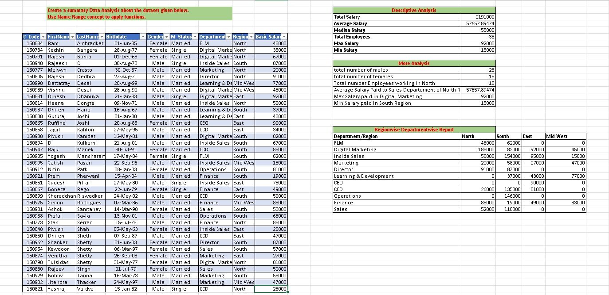

# 📊 Excel Assignment – Employee Data Analysis

## 📝 Assignment Task
> Create a Summary Data Analysis about the dataset given below.
> Use the **Name Range concept** to apply functions.

## 📂 Dataset Details
| Field | Info |
|---|---|
| Total Employees | 38 |
| Columns | C_Code, FirstName, LastName, Birthdate, Gender, M_Status, Department, Region, Basic Salary |

## ✅ Analysis Performed

### 1. Descriptive Analysis
| Metric | Value |
|---|---|
| Total Salary | ₹21,91,000 |
| Average Salary | ₹57,657 |
| Median Salary | ₹55,000 |
| Total Employees | 38 |
| Max Salary | ₹92,000 |
| Min Salary | ₹15,000 |

### 2. More Analysis
| Metric | Value |
|---|---|
| Total Males | 23 |
| Total Females | 15 |
| Employees in North | 10 |
| Avg Salary – Sales Dept (North) | ₹57,657 |
| Max Salary in Digital Marketing | ₹92,000 |
| Min Salary in South Region | ₹15,000 |

### 3. Regionwise Departmentwise Report
A salary matrix across Departments and Regions (North, South, East, Mid West).

## 🛠 Concepts & Functions Used
`Name Range` · `SUM` · `AVERAGE` · `MEDIAN` · `MAX` · `MIN` · `COUNTA` · `COUNTIF` · `SUMIF` · `AVERAGEIF`

## 📁 Files
- `Employee_Analysis.xlsx` – Excel workbook with full dashboard
- `Exal 1.jpeg` – Screenshot of the completed assignment

## 🖼 Screenshot

